Loading Required packages


```r
library(ggplot2)
```

```r
library(ggthemes)
library(lubridate)
library(dplyr)
```

```r
library(tidyr)
library(DT)
library(scales)
```

Set working directory


```r
setwd("D:/3S/DATASET'S/Uber-dataset")
```

## Creating color palette for plots


```r
colors = c("#CC1011", "#665555", "#05a399", "#cfcaca", "#f5e840", "#0683c9", "#e075b0")
```

## Reading Data from directory into Data frames


```r
apr_data <- read.csv("uber-raw-data-apr14.csv")
may_data <- read.csv("uber-raw-data-may14.csv")
jun_data <- read.csv("uber-raw-data-jun14.csv")
jul_data <- read.csv("uber-raw-data-jul14.csv")
aug_data <- read.csv("uber-raw-data-aug14.csv")
sep_data <- read.csv("uber-raw-data-sep14.csv")

# Combine the data together 
uber_data_raw <- rbind(apr_data, may_data, jun_data, jul_data, aug_data, sep_data)
cat("The dimensions of the data are:", dim(uber_data_raw))
```

```
## The dimensions of the data are: 4534327 4
```


```r
head(uber_data_raw)
```

```
##          Date.Time     Lat      Lon   Base
## 1 4/1/2014 0:11:00 40.7690 -73.9549 B02512
## 2 4/1/2014 0:17:00 40.7267 -74.0345 B02512
## 3 4/1/2014 0:21:00 40.7316 -73.9873 B02512
## 4 4/1/2014 0:28:00 40.7588 -73.9776 B02512
## 5 4/1/2014 0:33:00 40.7594 -73.9722 B02512
## 6 4/1/2014 0:33:00 40.7383 -74.0403 B02512
```

## Formatting The Raw Data

The data contains the columns Date.Time which is a factor, Latitude and Longitudes which are double and Base which is factor. we will format the datetime into a more readable format using the Date Time conversion function.


```r
uber_data_raw$Date.Time <- as.POSIXct(uber_data_raw$Date.Time, format="%m/%d/%Y %H:%M:%S")
uber_data_raw$Time <- format(as.POSIXct(uber_data_raw$Date.Time, format = "%m/%d/%Y %H:%M:%S"), format="%H:%M:%S")

uber_data_raw$Date.Time <- ymd_hms(uber_data_raw$Date.Time)
```

### Create individual columns for month day and year


```r
# Create individual columns for month day and year
uber_data_raw$day <- factor(day(uber_data_raw$Date.Time))
uber_data_raw$month <- factor(month(uber_data_raw$Date.Time, label=TRUE))
uber_data_raw$year <- factor(year(uber_data_raw$Date.Time))
uber_data_raw$dayofweek <- factor(wday(uber_data_raw$Date.Time, label=TRUE))
```

Adding Time variables as well


```r
# Add Time variables as well 
uber_data_raw$second = factor(second(hms(uber_data_raw$Time)))
uber_data_raw$minute = factor(minute(hms(uber_data_raw$Time)))
uber_data_raw$hour = factor(hour(hms(uber_data_raw$Time)))
uber_data <- uber_data_raw
```

# Data Visualization

### Plotting the trips by the hours in a day


```r
hourly_data <- uber_data |> 
                group_by(hour) |> 
                        dplyr::summarize(Total = n())
```

```
## `summarise()` ungrouping output (override with `.groups` argument)
```

```r
#Shows data in a searchable JS Table
datatable(hourly_data)
```


```r
ggplot(hourly_data,aes(hour,Total))+
geom_bar(stat = "identity",
         fill = "steelblue",
         color = "red")+
ggtitle("Trips Every Hour", subtitle = "aggregated today") + 
theme(legend.position = "none", 
      plot.title = element_text(hjust = 0.5), 
      plot.subtitle = element_text(hjust = 0.5)) + 
scale_y_continuous(labels=comma)
```

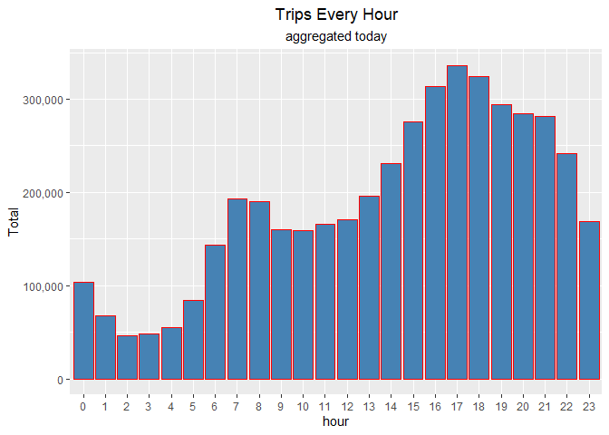<!-- -->


```r
monthly_hour_data <- uber_data |> group_by(month,hour) |> dplyr::summarize(Total=n())
```

```
## `summarise()` regrouping output by 'month' (override with `.groups` argument)
```

```r
datatable(monthly_hour_data)
```

\`summarise()\` has grouped output by 'month'. You can override using the \`.groups\` argument.

#### **Plotting trips by hour and month**


```r
ggplot(monthly_hour_data,aes(hour,Total,fill = month ))+
    geom_bar(stat = "identity")+
    ggtitle("Trips by Hourly Travel and month")+
    scale_y_continuous(labels = comma)
```

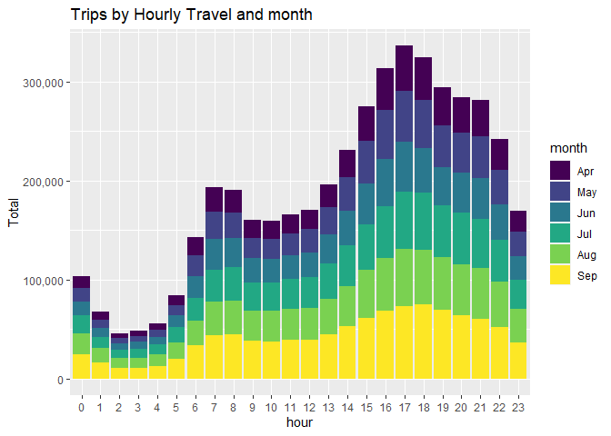<!-- -->

## **Plotting data by trips during every day of the month**


```r
day_data <- uber_data |> group_by(day) |> dplyr::summarize(Trips=n())
```

```
## `summarise()` ungrouping output (override with `.groups` argument)
```

```r
datatable(day_data)
```

## Plot the data for the day


```r
ggplot(day_data,aes(day,Trips))+
    geom_bar(stat = "identity",
             color = "steelblue")+
    ggtitle("Trips for each day of month")+
    theme(legend.position = "none")+
    scale_y_continuous(labels = comma)
```

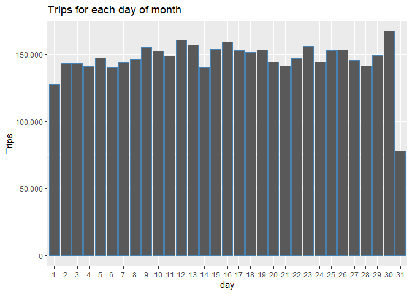<!-- -->

## **Plotting data by trips during every day of the week in month**


```r
dow_monthly_data <- uber_data |> group_by(dayofweek, month) |> dplyr::summarize(Trips = n())
```

```
## `summarise()` regrouping output by 'dayofweek' (override with `.groups` argument)
```

```r
datatable(dow_monthly_data)
```


```r
ggplot(dow_monthly_data, aes(dayofweek, Trips, fill = month))+
    geom_bar(stat = "identity", aes(fill = month), position = "dodge" )+
    ggtitle("Trips by Day and Month") + 
    scale_y_continuous(labels = comma) + 
    scale_fill_manual(values = colors)
```

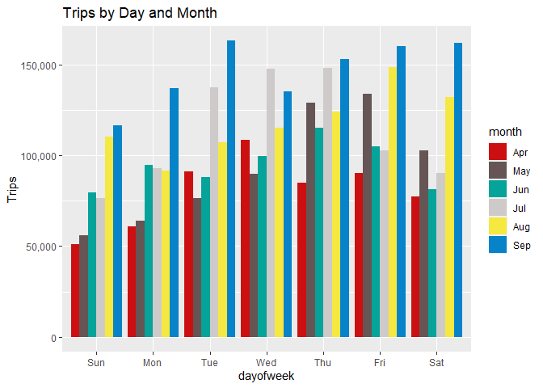<!-- -->

## **Number of Trips place during months in a year**


```r
month_data <- uber_data %>% group_by(month) %>% dplyr::summarize(Total = n())
```

```
## `summarise()` ungrouping output (override with `.groups` argument)
```

```r
datatable(month_data)
```

### Visualization


```r
ggplot(month_data,aes(month,Total))+
    geom_bar(stat = "Identity") + 
    ggtitle("Trips in a month") + 
    theme(legend.position = "none") + 
    scale_y_continuous(labels = comma) + 
    scale_fill_manual(values = colors)
```

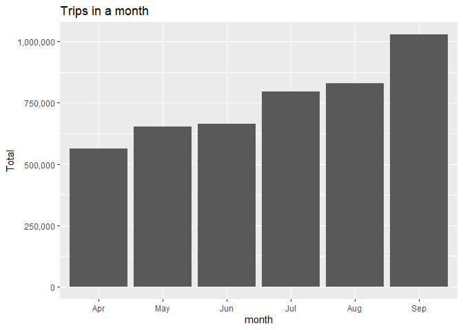<!-- -->

# **Heat-map visualization of day, hour and month**

#### **Heat-map by Hour and Day**


```r
ggplot(uber_data |> group_by(hour,day) |> dplyr::summarize(Trips = n()),aes(day,hour,Fill = Trips))+
    geom_tile(color = "white")+
    ggtitle("HeatMap for Trips")
```

```
## `summarise()` regrouping output by 'hour' (override with `.groups` argument)
```

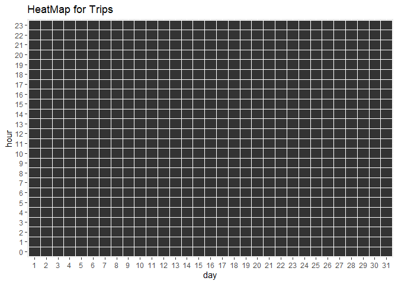<!-- -->


```r
day_hour_data <- uber_data %>% group_by(day, hour) %>% dplyr::summarize(Trips = n())
```

```
## `summarise()` regrouping output by 'day' (override with `.groups` argument)
```

```r
datatable(day_hour_data)
```


```r
ggplot(day_hour_data, aes(day, hour, fill = Trips)) + 
geom_tile(color = "white") + 
ggtitle("Heat Map by Hour and Day")
```

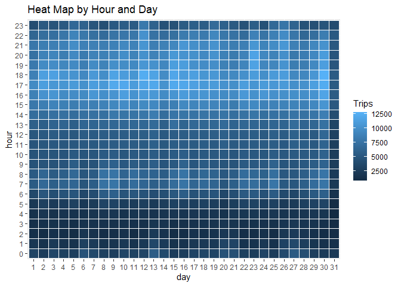<!-- -->


```r
day_month <- uber_data |> group_by(day,month) |> dplyr::summarize(Trips = n())
```

```
## `summarise()` regrouping output by 'day' (override with `.groups` argument)
```

```r
ggplot(day_month, aes(day, month, fill = Trips)) + 
geom_tile(color = "white") + 
ggtitle("Heat Map by Month and Day")
```

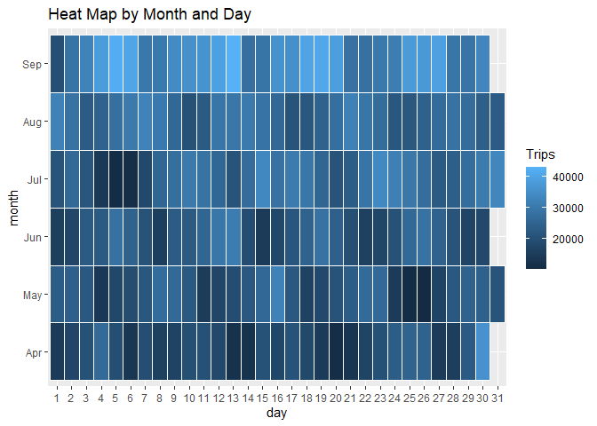<!-- -->


```r
month_base <-  uber_data %>%
                    group_by(Base, month) %>%
                        dplyr::summarize(Total = n()) 
```

```
## `summarise()` regrouping output by 'Base' (override with `.groups` argument)
```

```r
day0fweek_bases <-  uber_data %>%
                    group_by(Base, dayofweek) %>%
                        dplyr::summarize(Total = n()) 
```

```
## `summarise()` regrouping output by 'Base' (override with `.groups` argument)
```

```r
ggplot(month_base, aes(Base, month, fill = Total)) +
            geom_tile(color = "white") +
            ggtitle("Heat Map by Month and Bases")
```

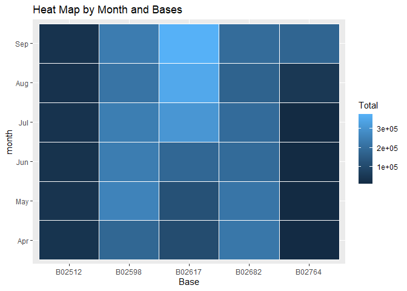<!-- -->


```r
ggplot(day0fweek_bases, aes(Base, dayofweek, fill = Total)) +
            geom_tile(color = "white") +
              ggtitle("Heat Map by Bases and Day of Week")
```

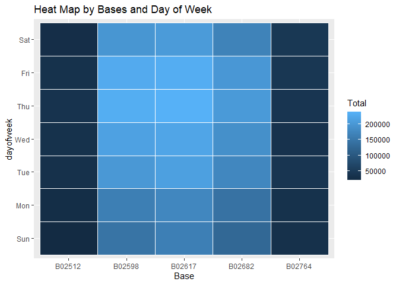<!-- -->

## Creating a map visualization of rides in New York

In the final section, we will visualize the rides in New York city by creating a geo-plot that will help us to visualize the rides during 2014 (Apr -- Sep) and by the bases in the same period.


```r
min_lat <- 40.5774
max_lat <- 40.9176
min_long <- -74.15
max_long <- -73.7004

ggplot(uber_data, aes(x=Lon, y=Lat)) +
  geom_point(size=1, color = "blue") +
     scale_x_continuous(limits=c(min_long, max_long)) +
      scale_y_continuous(limits=c(min_lat, max_lat)) +
        theme_map() +
           ggtitle("NYC MAP BASED ON UBER RIDES DURING 2014 (APR-SEP)")
```

```
## Warning: Removed 71701 rows containing missing values (geom_point).
```

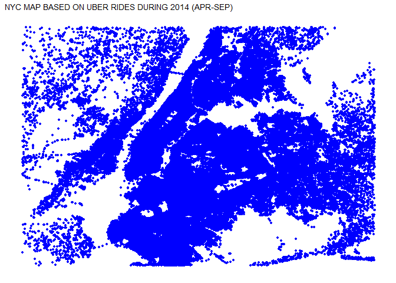<!-- -->


```r
ggplot(uber_data, aes(x=Lon, y=Lat, color = Base)) +
  geom_point(size=1) +
     scale_x_continuous(limits=c(min_long, max_long)) +
      scale_y_continuous(limits=c(min_lat, max_lat)) +
       theme_map() +
          ggtitle("NYC MAP BASED ON UBER RIDES DURING 2014 (APR-SEP) by BASE")
```

```
## Warning: Removed 71701 rows containing missing values (geom_point).
```

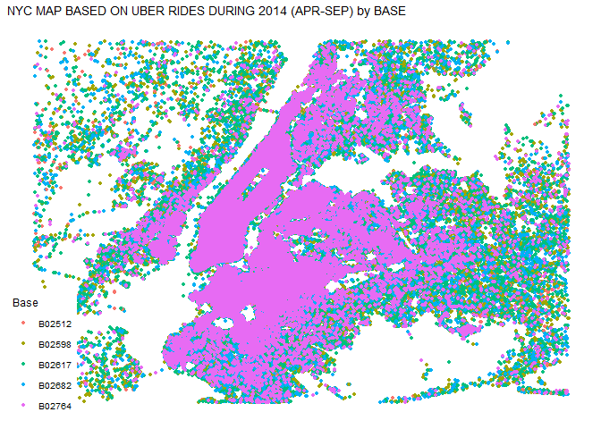<!-- -->
